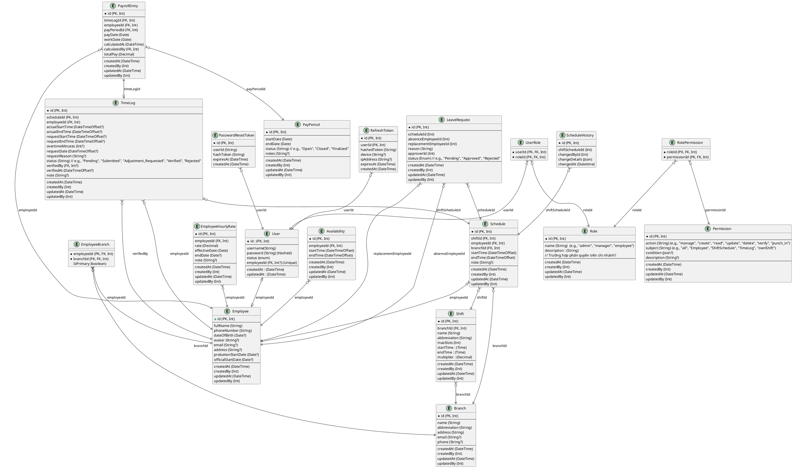

# Project Rules

## Domain Description

- **Branch Management**
  - Only Admin can add, update, delete branches.

- **Employee Management**
  - Only Admin can add, update, delete employees.
  - Employee fields: avatar, phone, email, ID number, DOB, gender, address, hire date.
  - An employee can work at multiple branches.

- **Shift Management**
  - Shifts belong to a branch.
  - Shifts can be customized per branch.
  - Shift example: 8:00-16:00, 10:00-16:00, 16:00-22:00.
  - Employees may start/end earlier/later than standard shift hours (recorded in attendance).

- **Special Shift Types**
  - Support custom working hours for special shift types.

- **Leave Requests**
  - Employees can request leave.
  - Employees can request a replacement (future feature, currently disabled).

- **Schedule**
  - Employee availability registration → Manager assigns → Final schedule stored.
  - Managers cannot edit availability after submission.

- **Payroll**
  - Auto-calculate payroll from assigned shifts + attendance data.
  - Compare with actual working hours.

---

## Entities & Relationships

